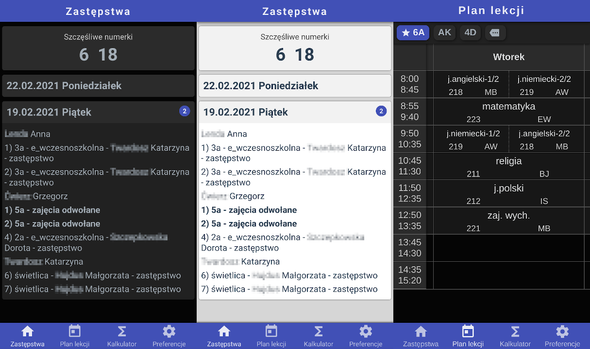

## Aplikacja internetowa pokazująca zastępstwa oraz szczęśliwe numerki

### Cechy

-   Wykonana w Vue.js
-   Działa offline (PWA)
-   Wysyła powiadomienia o zmianach
-   Ciemny i jasny motyw
-   Umżliwia wyświetlanie dowolnego planu lekcji
-   W pełni hostowana na Firebase
